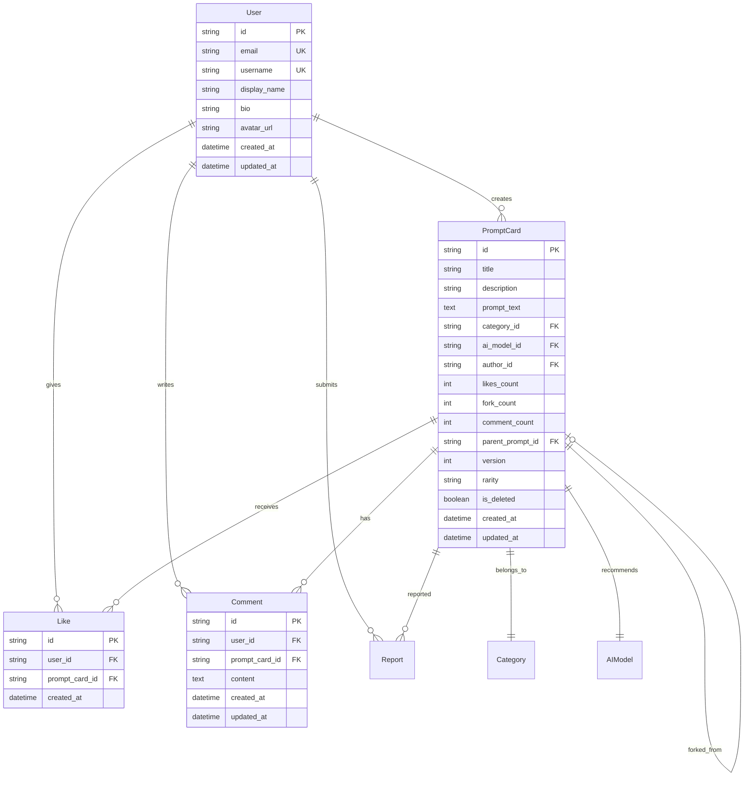

# Database Schema Documentation

## Overview

This document defines the database schema for PromptMint using Prisma ORM with Supabase PostgreSQL.

## Entity Relationship Diagram



## Prisma Schema

```prisma
// schema.prisma

generator client {
  provider = "prisma-client-js"
}

datasource db {
  provider = "postgresql"
  url      = env("DATABASE_URL")
}

model User {
  id          String   @id @default(uuid())
  email       String   @unique
  username    String   @unique
  displayName String   @map("display_name")
  bio         String?  @db.Text
  avatarUrl   String?  @map("avatar_url")
  createdAt   DateTime @default(now()) @map("created_at")
  updatedAt   DateTime @updatedAt @map("updated_at")
  
  // Relations
  promptCards PromptCard[]
  likes       Like[]
  comments    Comment[]
  reports     Report[]
  
  @@map("users")
}

model Category {
  id          String   @id @default(uuid())
  name        String   @unique
  slug        String   @unique
  description String?
  order       Int      @default(0)
  
  // Relations
  promptCards PromptCard[]
  
  @@map("categories")
}

model AIModel {
  id          String   @id @default(uuid())
  name        String   @unique
  slug        String   @unique
  displayName String   @map("display_name")
  order       Int      @default(0)
  
  // Relations
  promptCards PromptCard[]
  
  @@map("ai_models")
}

model PromptCard {
  id            String   @id @default(uuid())
  title         String   @db.VarChar(200)
  description   String   @db.Text
  promptText    String   @map("prompt_text") @db.Text
  categoryId    String   @map("category_id")
  aiModelId     String   @map("ai_model_id")
  authorId      String   @map("author_id")
  likesCount    Int      @default(0) @map("likes_count")
  forkCount     Int      @default(0) @map("fork_count")
  commentCount  Int      @default(0) @map("comment_count")
  parentPromptId String? @map("parent_prompt_id")
  version       Int      @default(1)
  rarity        Rarity   @default(BRONZE)
  isDeleted     Boolean  @default(false) @map("is_deleted")
  createdAt     DateTime @default(now()) @map("created_at")
  updatedAt     DateTime @updatedAt @map("updated_at")
  
  // Relations
  author       User       @relation(fields: [authorId], references: [id])
  category     Category   @relation(fields: [categoryId], references: [id])
  aiModel      AIModel    @relation(fields: [aiModelId], references: [id])
  parentPrompt PromptCard? @relation("PromptForks", fields: [parentPromptId], references: [id])
  forks        PromptCard[] @relation("PromptForks")
  likes        Like[]
  comments     Comment[]
  reports      Report[]
  
  @@index([categoryId])
  @@index([aiModelId])
  @@index([authorId])
  @@index([createdAt(sort: Desc)])
  @@index([likesCount(sort: Desc)])
  @@map("prompt_cards")
}

model Like {
  id           String   @id @default(uuid())
  userId       String   @map("user_id")
  promptCardId String   @map("prompt_card_id")
  createdAt    DateTime @default(now()) @map("created_at")
  
  // Relations
  user       User       @relation(fields: [userId], references: [id])
  promptCard PromptCard @relation(fields: [promptCardId], references: [id])
  
  @@unique([userId, promptCardId])
  @@index([promptCardId])
  @@map("likes")
}

model Comment {
  id           String   @id @default(uuid())
  userId       String   @map("user_id")
  promptCardId String   @map("prompt_card_id")
  content      String   @db.Text
  createdAt    DateTime @default(now()) @map("created_at")
  updatedAt    DateTime @updatedAt @map("updated_at")
  
  // Relations
  user       User       @relation(fields: [userId], references: [id])
  promptCard PromptCard @relation(fields: [promptCardId], references: [id])
  
  @@index([promptCardId])
  @@map("comments")
}

model Report {
  id           String       @id @default(uuid())
  userId       String       @map("user_id")
  promptCardId String       @map("prompt_card_id")
  reason       ReportReason
  description  String?      @db.Text
  status       ReportStatus @default(PENDING)
  createdAt    DateTime     @default(now()) @map("created_at")
  resolvedAt   DateTime?    @map("resolved_at")
  
  // Relations
  user       User       @relation(fields: [userId], references: [id])
  promptCard PromptCard @relation(fields: [promptCardId], references: [id])
  
  @@index([status])
  @@index([createdAt])
  @@map("reports")
}

// Enums
enum Rarity {
  BRONZE
  SILVER
  GOLD
  PLATINUM
}

enum ReportReason {
  INAPPROPRIATE_CONTENT
  SPAM
  COPYRIGHT_VIOLATION
  MALICIOUS_PROMPT
  OTHER
}

enum ReportStatus {
  PENDING
  REVIEWED
  RESOLVED
  DISMISSED
}
```

## Database Indexes

### Performance Optimization Indexes

1. **PromptCard Table**
   - `categoryId` - For category filtering
   - `aiModelId` - For AI model filtering
   - `authorId` - For user's cards listing
   - `createdAt DESC` - For latest cards feed
   - `likesCount DESC` - For popular cards sorting

2. **Like Table**
   - `[userId, promptCardId]` - Unique constraint to prevent duplicate likes
   - `promptCardId` - For counting likes per card

3. **Comment Table**
   - `promptCardId` - For loading comments per card

4. **Report Table**
   - `status` - For admin review queue
   - `createdAt` - For chronological review

## Seed Data

### Categories

```sql
INSERT INTO categories (name, slug, description, order) VALUES
('Programming', 'programming', 'Code generation, debugging, and development', 1),
('Writing', 'writing', 'Creative and professional writing', 2),
('Analysis & Research', 'analysis-research', 'Data analysis and research tasks', 3),
('Learning & Education', 'learning-education', 'Educational and study prompts', 4),
('Creative & Art', 'creative-art', 'Creative and artistic prompts', 5),
('Others', 'others', 'Miscellaneous prompts', 6);
```

### AI Models

```sql
INSERT INTO ai_models (name, slug, display_name, order) VALUES
('Claude', 'claude', 'Claude', 1),
('GPT', 'gpt', 'ChatGPT', 2),
('Gemini', 'gemini', 'Gemini', 3),
('Others', 'others', 'Others', 4);
```

## Supabase Row Level Security (RLS) Policies

### Users Table

```sql
-- Users can read all profiles
CREATE POLICY "Public profiles are viewable by everyone" ON users
FOR SELECT USING (true);

-- Users can update own profile
CREATE POLICY "Users can update own profile" ON users
FOR UPDATE USING (auth.uid() = id);
```

### PromptCard Table

```sql
-- Anyone can view non-deleted cards
CREATE POLICY "Public cards are viewable by everyone" ON prompt_cards
FOR SELECT USING (is_deleted = false);

-- Authenticated users can mint cards
CREATE POLICY "Authenticated users can mint cards" ON prompt_cards
FOR INSERT WITH CHECK (auth.uid() = author_id);

-- Users can update own cards
CREATE POLICY "Users can update own cards" ON prompt_cards
FOR UPDATE USING (auth.uid() = author_id);

-- Users can soft delete own cards
CREATE POLICY "Users can delete own cards" ON prompt_cards
FOR UPDATE USING (auth.uid() = author_id) 
WITH CHECK (is_deleted = true);
```

### Like Table

```sql
-- Anyone can view likes
CREATE POLICY "Likes are viewable by everyone" ON likes
FOR SELECT USING (true);

-- Authenticated users can like
CREATE POLICY "Authenticated users can like" ON likes
FOR INSERT WITH CHECK (auth.uid() = user_id);

-- Users can remove own likes
CREATE POLICY "Users can remove own likes" ON likes
FOR DELETE USING (auth.uid() = user_id);
```

### Comment Table

```sql
-- Anyone can view comments
CREATE POLICY "Comments are viewable by everyone" ON comments
FOR SELECT USING (true);

-- Authenticated users can comment
CREATE POLICY "Authenticated users can comment" ON comments
FOR INSERT WITH CHECK (auth.uid() = user_id);

-- Users can update own comments
CREATE POLICY "Users can update own comments" ON comments
FOR UPDATE USING (auth.uid() = user_id);
```

## Database Triggers

### Update Counts Trigger

```sql
-- Function to update likes_count
CREATE OR REPLACE FUNCTION update_likes_count() 
RETURNS TRIGGER AS $$
BEGIN
  IF TG_OP = 'INSERT' THEN
    UPDATE prompt_cards 
    SET likes_count = likes_count + 1 
    WHERE id = NEW.prompt_card_id;
  ELSIF TG_OP = 'DELETE' THEN
    UPDATE prompt_cards 
    SET likes_count = likes_count - 1 
    WHERE id = OLD.prompt_card_id;
  END IF;
  RETURN NULL;
END;
$$ LANGUAGE plpgsql;

-- Trigger for likes
CREATE TRIGGER update_prompt_likes_count
AFTER INSERT OR DELETE ON likes
FOR EACH ROW EXECUTE FUNCTION update_likes_count();
```

### Update Rarity Trigger

```sql
-- Function to update rarity based on likes
CREATE OR REPLACE FUNCTION update_card_rarity() 
RETURNS TRIGGER AS $$
BEGIN
  IF NEW.likes_count >= 100 THEN
    NEW.rarity = 'PLATINUM';
  ELSIF NEW.likes_count >= 50 THEN
    NEW.rarity = 'GOLD';
  ELSIF NEW.likes_count >= 20 THEN
    NEW.rarity = 'SILVER';
  ELSE
    NEW.rarity = 'BRONZE';
  END IF;
  RETURN NEW;
END;
$$ LANGUAGE plpgsql;

-- Trigger for rarity update
CREATE TRIGGER update_rarity_on_likes_change
BEFORE UPDATE OF likes_count ON prompt_cards
FOR EACH ROW EXECUTE FUNCTION update_card_rarity();
```

## Migration Notes

1. **Initial Setup**
   - Run Prisma migrations to create tables
   - Execute seed data for categories and AI models
   - Apply RLS policies via Supabase dashboard
   - Create database triggers
   - Initialize PromptMint platform data

2. **Future Considerations**
   - Add full-text search indexes for prompt content
   - Consider partitioning for large tables
   - Add composite indexes based on query patterns
   - Implement archival strategy for old data
